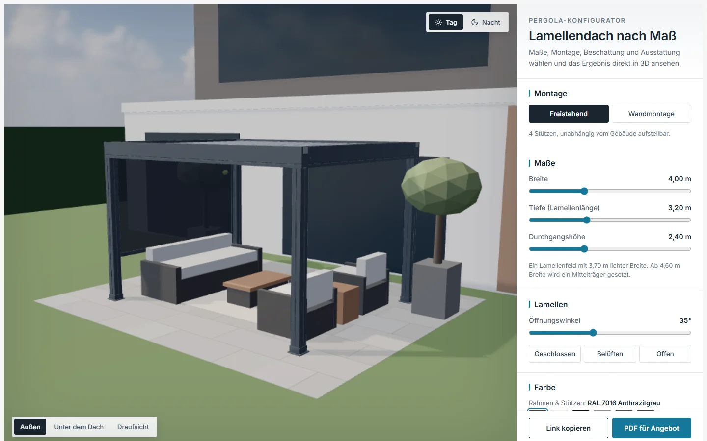
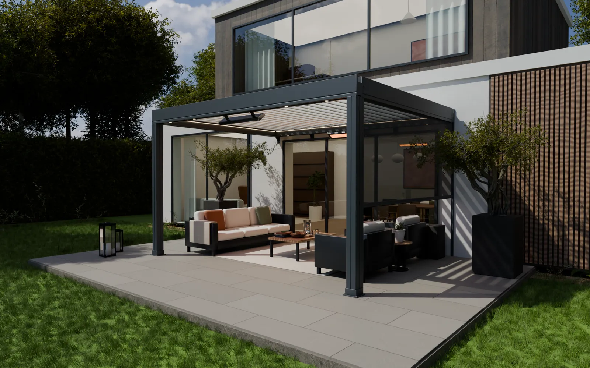
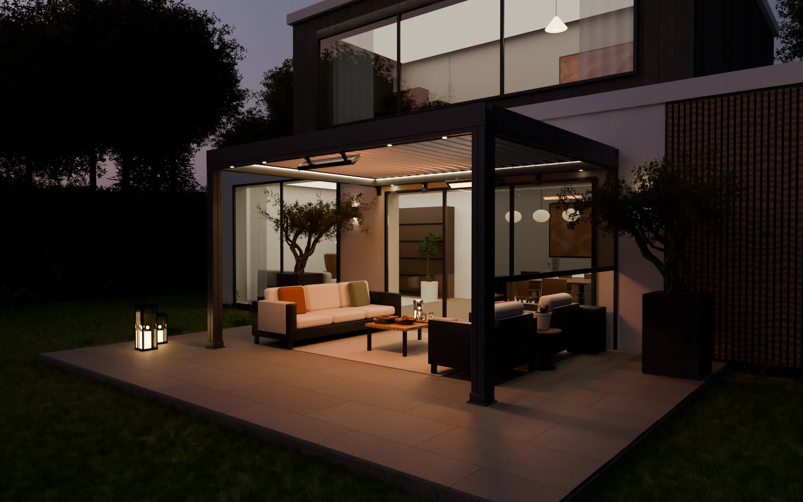

<!--
ENTWURF. Grundlage: Code und Dateien aus dem Ordner Konfigurator.
Alles in [eckigen Klammern] musst du ergänzen oder prüfen.
Prüfen: Rolle (welche Teile hast du selbst gebaut, z. B. das Pergola-Modell?), Live-URL, Repo.
Wichtig: Die Oberfläche folgt der Gestaltung deines Arbeitgebers (Farben, Inter, 4-px-Ecken).
Kläre, ob das Projekt als Side-Project gelten darf oder ob es der Firma gehört.
-->

## Idee

Wer eine Terrassenüberdachung kaufen will, versteht ein Datenblatt selten. Er will sehen, wie sie bei ihm aussieht. Der Konfigurator zeigt eine Lamellen-Pergola in 3D und lässt sie live ändern, ohne Installation und ohne Server.

## Was er kann

- **Maße und Montage:** Breite (2,5 bis 7 m), Tiefe, Durchgangshöhe, freistehend oder an der Wand.
- **Lamellen:** Öffnungswinkel von 0 bis 90° mit Voreinstellungen, Farbe für Rahmen, Stützen und Lamellen.
- **Ausstattung:** ZIP-Screens pro Seite, LED-Lichtleiste und Spots (warm oder kalt, dimmbar), Infrarot-Heizstrahler.
- **Umgebung:** Tag oder Nacht, drei Ansichten (außen, unter dem Dach, Draufsicht), Möblierung, die sich der Größe anpasst.
- **Ergebnis:** Eine Zusammenfassung (Fläche, Höhe, Lamellen, Stützen), ein Link zur Konfiguration und ein PDF für das Angebot.

## Entscheidungen

### Eine Datei, kein Backend

Die Konfiguration steckt vollständig im Link, in der URL. Wer ihn öffnet, sieht genau dieselbe Pergola. Das Modell und die Himmel sind in eine einzige HTML-Datei eingebettet, three.js kommt vom CDN. So lässt sich der Konfigurator überall einbinden und braucht keine Datenbank.

### Schnell genug für jeden Rechner

Die Lamellen sind instanziert, damit das Drehen flüssig bleibt. Weiche Schatten und Umgebungsverdeckung sind ein Schalter ("Hohe Darstellungsqualität"), standardmäßig aus und im Browser gemerkt.

### Licht, das zum Himmel passt

Ein Python-Skript in Blender findet den hellsten Punkt des HDRI-Himmels und speichert Sonnenposition und -höhe. Der Konfigurator dreht den Himmel so, dass die Sonne im Bild genau dort steht, wo das Licht der Szene herkommt. So passen Schatten und Himmel zusammen.

### Zwei Wege, ein Modell

Die fotorealistischen Renderings entstehen in Blender, mit CC0-Materialien und -Möbeln von Poly Haven. Im Browser sind Möbel und Haus bewusst einfache Blöcke, damit die Seite klein bleibt. Beides kommt aus derselben Szene und wird per Skript exportiert.

### Bedienbar für alle

Auswahlknöpfe tragen ihren Zustand (`aria-pressed`), die Zusammenfassung wird von Screenreadern vorgelesen, Animationen respektieren `prefers-reduced-motion`, und auf schmalen Bildschirmen stapelt sich die Oberfläche.

## Stand

Der Konfigurator ist ein Prototyp, den ich an einem Wochenende gebaut habe. Die Konfiguration, die 3D-Darstellung, der Link zum Teilen und das PDF funktionieren. Für den echten Einsatz fehlt noch die Geschäftslogik:

- **Preislogik:** Preise aus Maßen, Ausstattung und Montage berechnen.
- **Daten in einer Datenbank:** Optionen, Farben, Preise und Regeln in Tabellen statt im Code.
- **Anbindung an WooCommerce:** aus einer Konfiguration eine Anfrage oder Bestellung machen.

[Ergänze: Ist ein Einsatz beim Arbeitgeber geplant, und was ist die Reihenfolge der nächsten Schritte?]

## Rückblick

[Was war am schwierigsten, zum Beispiel Licht, Performance oder das PDF? Was würdest du heute anders machen?]
