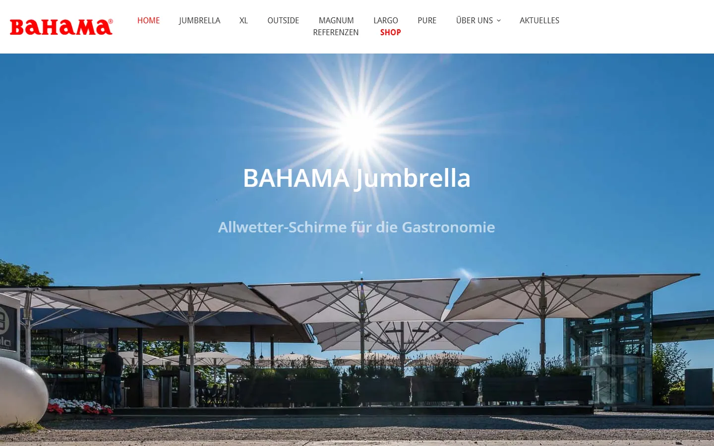
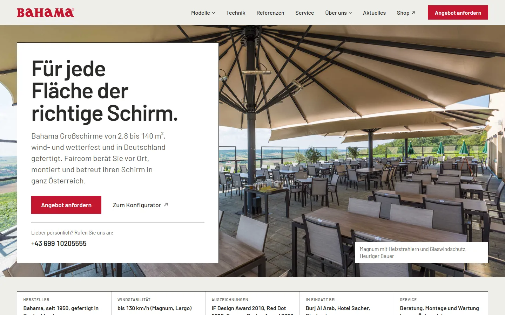
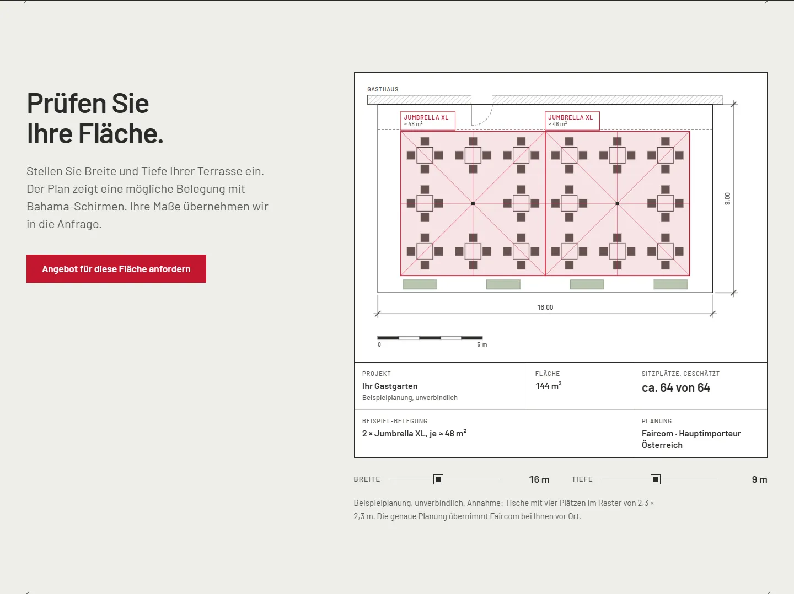
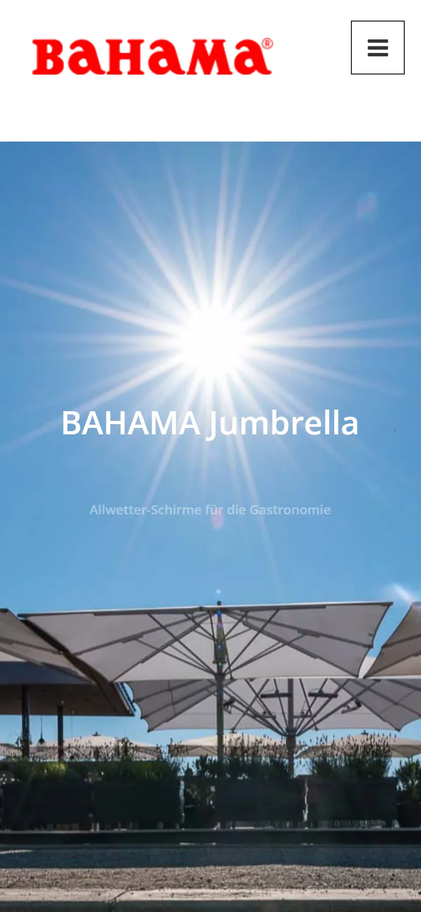
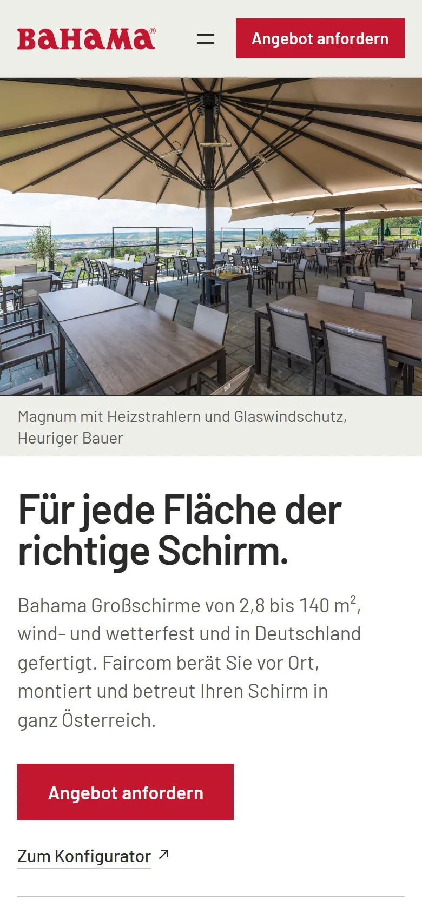

import PageSpeed from '../../../components/PageSpeed.astro';

{/*
DRAFT. Based on the code and PRODUCT.md of the lipowec-landing theme and screenshots of bahama.at and bahama.local.
Before publishing: get approval from Faircom (and your employer if relevant).
Open: role, launch date, live URL (url field), after values of the PageSpeed table.
*/}

## Background

Bahama builds large umbrellas for hospitality, from 2.8 to 140 m². In Austria they are sold by Faircom, the main importer. The website should show restaurant and hotel owners which umbrella fits their area and lead them to an enquiry.

The previous home page was a large image with a menu. No copy, no way to get in touch, no enquiry. It was built with a page builder and a pile of legacy plugins, and it was slow on phones.

## Goal

Every page ends with a clear next step: **request a quote** or **go to the configurator**. For that, an owner has to understand quickly which of the six models fits their terrace, and why they can trust the engineering.

## Implementation

### A block theme from scratch

Instead of the page builder there is a custom block theme for the Gutenberg editor. 13 custom blocks (model range, engineering, size table, references, enquiry and more) are registered via Secure Custom Fields. The field groups live as JSON in the theme, so they are versioned. The team edits content in the editor without breaking the layout.

### The area planner

The centrepiece is an interactive plan. Set the width and depth of the terrace, and the planner draws a floor plan with a table grid (2.3 m per table including aisle) and suggests a layout, from the small Pure to the Magnum. It shows area, estimated seats and model, and carries the dimensions straight into the enquiry.

### Trust through facts

Large umbrellas are an investment. The page answers objections before they come up: wind stability, the build of the umbrella part by part, a manufacturer since 1950, awards and references. All figures come from the manufacturer and are approved.

### Enquiries without a plugin

The enquiry form is part of the theme. It checks a nonce, sanitises every input and sends the enquiry via `wp_mail`. Fonts are self-hosted in the theme, without the Google Fonts CDN, and the key ones are preloaded.

### On the phone

Old home page on the left, new one on the right.

 

## Performance

<PageSpeed
  lang="en"
  date="29 Sep 2026"
  url="bahama.at"
  mobile={{ before: { performance: 34, accessibility: 86, bestPractices: 96, seo: 85 } }}
  desktop={{ before: { performance: 65, accessibility: 83, bestPractices: 100, seo: 85 } }}
/>

## Status

The relaunch runs locally. [Add status and launch date.] After launch, the after values go into the table.

## Retrospective

[What was hardest, and what would you do differently today?]
